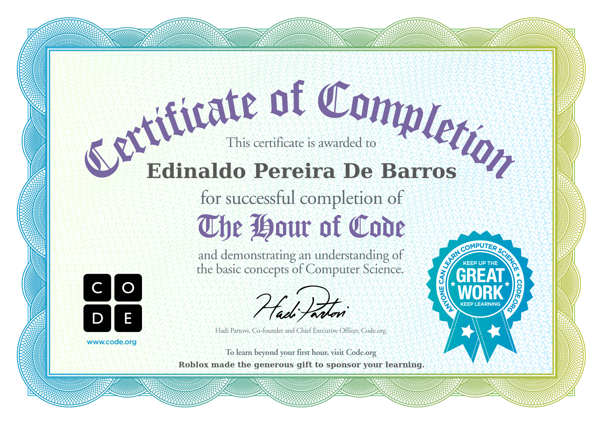
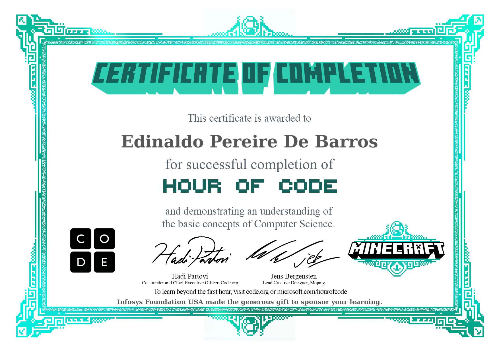

Introdução a Lógica de Programação com Scratch

# scratch
- [Pdv](https://scratch.mit.edu/projects/884841164/editor/)
- [Milhas-km](https://scratch.mit.edu/projects/884617968/editor/)
- [Regua de Três](https://scratch.mit.edu/projects/882635066/editor/)
- [Cálculo da Média](https://scratch.mit.edu/projects/881964953/editor/)
- [Libra-Kg](https://scratch.mit.edu/projects/884624628/editor/)
- [Custo x Venda](https://scratch.mit.edu/projects/884629885/editor/)
- [Conversor de Temperatura](https://scratch.mit.edu/projects/882616220/editor/)
- [Cálculo do Valor da Hora do Técnico](https://scratch.mit.edu/projects/885030225/editor/)
- [Atividade a Hora do Código](https://studio.code.org/print_certificates/eyJuYW1lIjoiRWRpbmFsZG8gUGVyZWlyYSBEZSBCYXJyb3MiLCJjb3Vyc2UiOiJob3Vyb2Zjb2RlIiwiZG9ub3IiOiJSb2Jsb3gifQ==)
- [Atividade a Hora do Código Code.org](https://studio.code.org/print_certificates/eyJuYW1lIjoiRWRpbmFsZG8gUGVyZWlyZSBEZSBCYXJyb3MiLCJjb3Vyc2UiOiJtYyIsImRvbm9yIjoiSW5mb3N5cyBGb3VuZGF0aW9uIFVTQSJ9)
- [Calcula de Serviço](https://scratch.mit.edu/projects/886837982/)
  

## Autor
# Edinaldo Barros

## Hora do Código:

